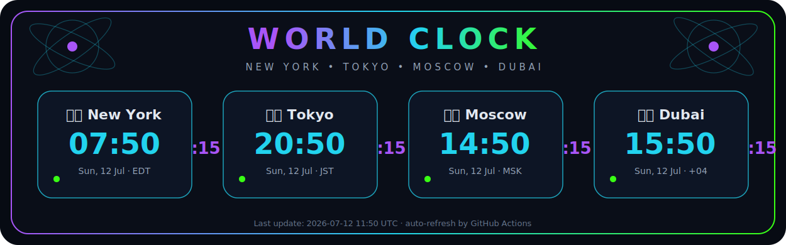

PQC English Wordlist Standard

- Total words: 4096
- Bits per word: 12
- Sorting: alphabetical
- Indexing: zero-based
- Index 0 = first line
- Index 4095 = last line
- Binary format: 12-bit unsigned integer
- Seed format: 33 words
- Entropy: 384 bits
- Checksum: 12 bits
- Total seed bits: 396 bits

  

  

